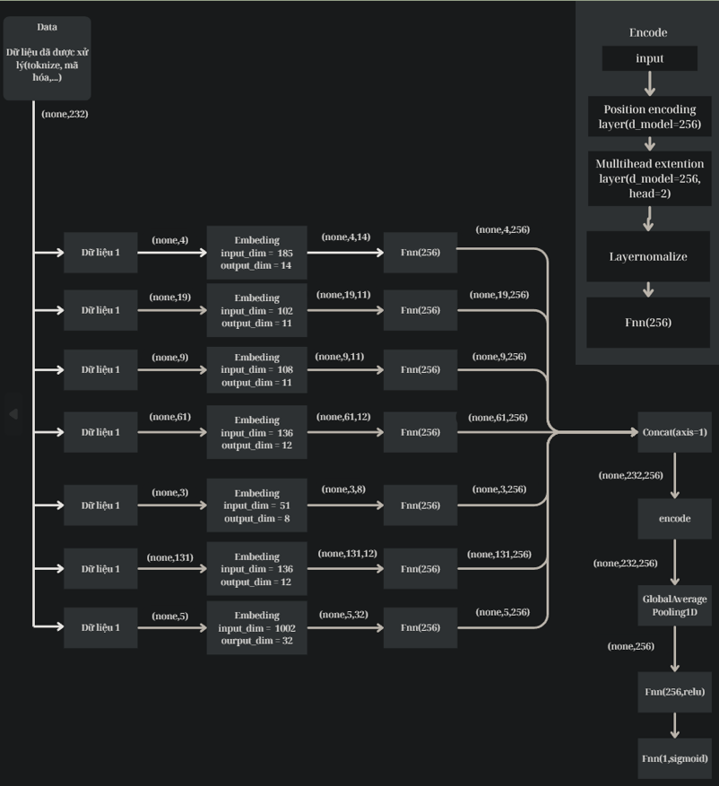
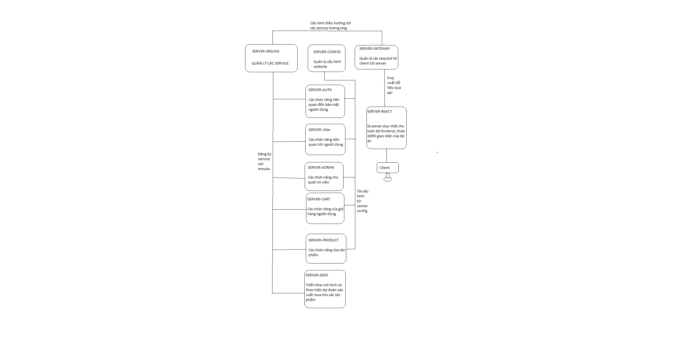

## PHÁT TRIỂN HỆ THỐNG KHUYẾN NGHỊ SẢN PHẨM DỰA TRÊN COLLABORATIVE FILTERING


## Giới thiệu
- Dự án hướng tới xây dựng một hệ thống gợi ý sản phẩm thông minh, giúp cá nhân hóa trải nghiệm mua sắm của từng người dùng. Thay vì chỉ dựa vào lịch sử tương tác như các hệ thống truyền thống, hệ thống này kết hợp thông tin từ cả người dùng và sản phẩm để đưa ra các gợi ý chính xác và phù hợp hơn.
- Ý tưởng cốt lõi là thu thập và biểu diễn một nhóm gồm 30 đặc trưng, bao gồm thông tin hành vi, sở thích của người dùng và đặc điểm sản phẩm. Các đặc trưng này sau đó được kết hợp lại thành từng cặp người dùng – sản phẩm, rồi đưa vào mô hình để học cách đánh giá mức độ phù hợp giữa hai bên. Việc biểu diễn riêng biệt từng loại đặc trưng và sau đó đưa vào quá trình học sâu giúp tối ưu hóa khả năng mô tả, từ đó nâng cao chất lượng gợi ý.

## Thành viên thực hiện
- Nguyễn Lê Quốc Bảo - tham gia đóng góp 100% (bản thân) (Cài đặt huấn luyện mô hình, code xử lý data, tìm kiếm nguồn data, code demo cho mô hình sau huấn luyện, viết báo cáo).

## Các vị trí bản thân trong dự án
- Ba (phân tích mô hình, tìm kiếm mô hình, tìm kiếm data, viết báo cáo).
- leader (Điều hành, quản lý dự án)
- fullstask (web)

## Mô hình sử dụng và lĩnh vực 
- Collaborative Filtering (CF) với lõi chính là lớp encode của tranformer(đồng thời áp dụng mullti embeding biểu diễn mối quan hệ trong từng ngữ cảnh của dữ liệu)
- Lĩnh vực xử lý ngôn ngữ tự nhiên

## 🧰 Các thư viện, công cụ và ngôn ngữ sử dụng trong dự án

### 1. 📝 Ngôn ngữ sử dụng

- Python
- Java
- JavaScript
- HTML, CSS

---

### 2. 📚 Thư viện sử dụng

- OpenCV
- NumPy
- TensorFlow
- Scikit-learn
- Pandas
- Spring Boot
- ReactJS
- Flask

---

### 3. 🗄️ Cơ sở dữ liệu

- SQL Server

---

### 4. 🛠️ Công cụ & IDE sử dụng

- **VSCode** – Dùng cho Flask và React
- **IntelliJ IDEA** – Dùng cho Spring Boot
- **Jupyter Lab (Local - GPU)** – Dùng để training và tạo dữ liệu
- **Postman** – Test API
- **[dbdiagram.io](https://dbdiagram.io/)** – Thiết kế database

## Kiến trúc mô hình, web site

### Kiến trúc mô hình:

### Kiến trúc web:


---

## Loss sau 80 epochs


---

## Phân bố dự đoán


---

## So sánh phân bố dự đoán và phân bố nhãn


---

## Ma trận dự đoán


---

## 🎥 Video demo cho dự án
[](https://www.youtube.com/watch?v=CivdCAs3dYY)

---

## 📄 Tài liệu chi tiết của dự án

- 📘 [Báo cáo chi tiết dự án (Word)](report/bao_cao_nguyen_le_quoc_bao_2100004053.docx)
- 📊 [Báo cáo tóm tắt dự án (PowerPoint)](report/bao_cao_de_xuat_san_pham_khong_theo_form_truong.pptx)
- 📝 [Báo cáo tóm tắt dự án (PowerPoint, theo format NTTU)](report/bao_cao_de_xuat_san_pham_theo_form_truong.pptx)
- 📄 [FSD – Mô tả chức năng hệ thống (Word)](report/mo_ta_chuc_nang(FSD).docx)
- 🗃️ [DDD – Mô tả cơ sở dữ liệu (Word)](report/mo_ta_database(DDD).docx)
- 📑 [API Document – Mô tả các API (Word)](report/mo_ta_api(api_document).docx)
- 🗺️ [Sơ đồ cơ sở dữ liệu (PNG)](web_function/database/Untitled%20(1).png)

---

## Hướng dẫn clone dự án

### 1. Thiếu thư mục `data` trong `./data`
Khi clone project từ GitHub về, bạn sẽ thiếu một số thư mục, bao gồm:

- Tạo thư mục `./data/data`.
- Tải file data training và file column về, đặt vào thư mục `./data/data`.

🔗 [Link data training](https://drive.google.com/drive/folders/10Xa5yRClfg0tcrF0EXb-o8jLLoYuYe34?usp=sharing)

---

### 2. Thiếu thư mục `data` và `model` trong `./web/web_builder/deep_service`

- Tạo thư mục `data` trong `./web/web_builder/deep_service`.
- Tải các file sau: `name_column.txt`, `test.txt`, `synthetic_data_0.txt`.
- Đặt các file trên vào thư mục `data` vừa tạo.

🔗 [Link data deep_service](https://drive.google.com/drive/folders/1CcGGmuG2IJ-edf2JV_gFiDMupLlum87d?usp=sharing)

- Tiếp theo, tạo thư mục `model` trong `./web/web_builder/deep_service`.
- Tải model và đặt vào thư mục `model`.

🔗 [Link model deep_service](https://drive.google.com/drive/folders/1D4BJVCL1Xen3dOzaIZpTO5OkbU_sO3YY?usp=sharing)

---

### 3. Thiếu thư mục `img` trong `./web/web_builder/react_web/react_web/public`

- Tạo thư mục `img` trong `./web/web_builder/react_web/react_web/public`.
- Tải ảnh và đặt vào thư mục `img`.

🔗 [Link ảnh trong img react](https://drive.google.com/drive/folders/1fzNUhYglnpq4-t61P4Jbctqe_UkRY6og?usp=sharing)

---

### 4. Cài đặt `node_modules` cho React

- Trong thư mục React, chạy lệnh sau để cài đặt các dependency:

```bash
npm install