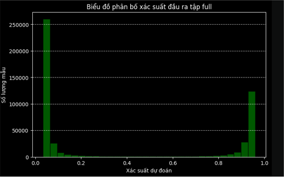
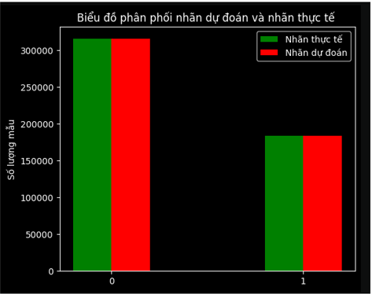
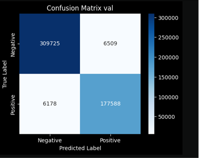

# 🛍️ PHÁT TRIỂN HỆ THỐNG KHUYẾN NGHỊ SẢN PHẨM DỰA TRÊN COLLABORATIVE FILTERING


---

## 📌 Giới thiệu

Dự án hướng tới xây dựng một **hệ thống gợi ý sản phẩm thông minh** nhằm cá nhân hóa trải nghiệm mua sắm cho từng người dùng. Thay vì chỉ dựa vào lịch sử tương tác như các hệ thống truyền thống, hệ thống này **kết hợp thông tin từ cả người dùng và sản phẩm** để đưa ra gợi ý chính xác và phù hợp hơn.

🔍 **Ý tưởng cốt lõi**:

- Biểu diễn dữ liệu thông qua **30 đặc trưng đầu vào**, bao gồm:
  - Hành vi và sở thích của người dùng.
  - Đặc điểm chi tiết của sản phẩm.

- Các đặc trưng này được **kết hợp thành cặp người dùng – sản phẩm**, sau đó đưa vào mô hình để học cách đánh giá mức độ phù hợp giữa hai bên.

- Việc biểu diễn riêng biệt từng loại đặc trưng trước khi đưa vào mạng học sâu giúp:
  - Tăng khả năng mô tả ngữ cảnh.
  - Cải thiện chất lượng gợi ý đáng kể.

---

## 👤 Thành viên thực hiện

- **Nguyễn Lê Quốc Bảo** – đóng góp 100% các công việc:
  - Cài đặt và huấn luyện mô hình.
  - Xử lý và thu thập dữ liệu.
  - Thiết kế và lập trình phần demo mô hình sau huấn luyện.
  - Viết toàn bộ báo cáo.

---

## 💼 Vai trò đảm nhận trong dự án

- 📊 **Phân tích – nghiên cứu mô hình**: lựa chọn kiến trúc phù hợp, tìm hiểu mô hình tiên tiến.
- 🔍 **Tìm kiếm dữ liệu**: tổng hợp dữ liệu người dùng và sản phẩm.
- 📑 **Viết báo cáo**: báo cáo chi tiết, trình bày kết quả và demo.
- 🧠 **Trưởng nhóm (Leader)**: quản lý, điều phối toàn bộ tiến độ dự án.
- 🌐 **Lập trình Fullstack Web**: xây dựng giao diện người dùng, kết nối backend và AI.

---

## 🤖 Mô hình sử dụng & Lĩnh vực áp dụng

- **Mô hình**: Collaborative Filtering (CF) kết hợp với:
  - Lớp **Encoder của Transformer** làm lõi chính.
  - **Multi-embedding** để biểu diễn linh hoạt đặc trưng trong từng ngữ cảnh.

- **Lĩnh vực**: Xử lý ngôn ngữ tự nhiên (NLP) ứng dụng vào dữ liệu dạng bảng và hành vi người dùng.

---

## 🧰 Các thư viện, công cụ và ngôn ngữ sử dụng trong dự án

### 1. 📝 Ngôn ngữ sử dụng

- Python
- Java
- JavaScript
- HTML, CSS

---

### 2. 📚 Thư viện sử dụng

- OpenCV
- NumPy
- TensorFlow
- Scikit-learn
- Pandas
- Spring Boot
- ReactJS
- Flask

---

### 3. 🗄️ Cơ sở dữ liệu

- SQL Server

---

### 4. 🛠️ Công cụ & IDE sử dụng

- **VSCode** – Dùng cho Flask và React
- **IntelliJ IDEA** – Dùng cho Spring Boot
- **Jupyter Lab (Local - GPU)** – Dùng để training và tạo dữ liệu
- **Postman** – Test API
- **[dbdiagram.io](https://dbdiagram.io/)** – Thiết kế database

## 🧠 Kiến trúc hệ thống

- 🧩 [Kiến trúc mô hình AI](./ai_function/result/kien_truc_mo_hinh.png)
- 🕸️ [Kiến trúc hệ thống Web](./ai_function/result/kien_truc_web.png)

---

## Loss sau 80 epochs


---

## Phân bố dự đoán


---

## So sánh phân bố dự đoán và phân bố nhãn


---

## Ma trận dự đoán


---

## 🎥 Video demo cho dự án
[](https://www.youtube.com/watch?v=CivdCAs3dYY)

---

## 📄 Tài liệu chi tiết của dự án

- 📘 [Báo cáo chi tiết dự án (Word)](report/bao_cao_nguyen_le_quoc_bao_2100004053.docx)
- 📊 [Báo cáo tóm tắt dự án (PowerPoint)](report/bao_cao_de_xuat_san_pham_khong_theo_form_truong.pptx)
- 📝 [Báo cáo tóm tắt dự án (PowerPoint, theo format NTTU)](report/bao_cao_de_xuat_san_pham_theo_form_truong.pptx)
- 📄 [FSD – Mô tả chức năng hệ thống (Word)](report/mo_ta_chuc_nang(FSD).docx)
- 🗃️ [DDD – Mô tả cơ sở dữ liệu (Word)](report/mo_ta_database(DDD).docx)
- 📑 [API Document – Mô tả các API (Word)](report/mo_ta_api(api_document).docx)
- 🗺️ [Sơ đồ cơ sở dữ liệu (PNG)](web_function/database/Untitled%20(1).png)

---

## Hướng dẫn clone dự án

### 1. Thiếu thư mục `data` trong `./data`
Khi clone project từ GitHub về, bạn sẽ thiếu một số thư mục, bao gồm:

- Tạo thư mục `./data/data`.
- Tải file data training và file column về, đặt vào thư mục `./data/data`.

🔗 [Link data training](https://drive.google.com/drive/folders/10Xa5yRClfg0tcrF0EXb-o8jLLoYuYe34?usp=sharing)

---

### 2. Thiếu thư mục `data` và `model` trong `./web/web_builder/deep_service`

- Tạo thư mục `data` trong `./web/web_builder/deep_service`.
- Tải các file sau: `name_column.txt`, `test.txt`, `synthetic_data_0.txt`.
- Đặt các file trên vào thư mục `data` vừa tạo.

🔗 [Link data deep_service](https://drive.google.com/drive/folders/1CcGGmuG2IJ-edf2JV_gFiDMupLlum87d?usp=sharing)

- Tiếp theo, tạo thư mục `model` trong `./web/web_builder/deep_service`.
- Tải model và đặt vào thư mục `model`.

🔗 [Link model deep_service](https://drive.google.com/drive/folders/1D4BJVCL1Xen3dOzaIZpTO5OkbU_sO3YY?usp=sharing)

---

### 3. Thiếu thư mục `img` trong `./web/web_builder/react_web/react_web/public`

- Tạo thư mục `img` trong `./web/web_builder/react_web/react_web/public`.
- Tải ảnh và đặt vào thư mục `img`.

🔗 [Link ảnh trong img react](https://drive.google.com/drive/folders/1fzNUhYglnpq4-t61P4Jbctqe_UkRY6og?usp=sharing)

---

### 4. Cài đặt `node_modules` cho React

- Trong thư mục React, chạy lệnh sau để cài đặt các dependency:

```bash
npm install